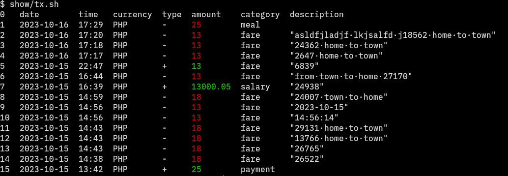

# Personal Finance Tracker

A framework for tracking transactions



## Usage

```sh
# Save a transaction
mkdir -p tx/25XMR/nft/"sold pixelart"

# Paid public transport?
mkdir -p tx/-25PHP/fare/"from town to home"

# Received a gift?
mkdir -p tx/+25,000PHP/gift/"Mrs. Robinson's gift"
```

Example: `mkdir -p tx/25XMR/nft/"sold pixel art"` wherein

- `25` is the amount. It can be negative for expenses or positive for inflow.
- `XMR` is the currency
- `nft` is the transaction category 
- `sold pixelart` is the description of the transaction. 
    If this is a recurring transaction, $RANDOM can be used for each instance of transaction .e.g. 
    ```sh
    mkdir -p tx/12PHP/fare/"House to town $RANDOM"
    ```

    Note: It's okay to use `$RANDOM` because this framework depends on the datetime metadata of the directory.
    
    Metadata is key for this project to work[^1]. Therefore, moving the files to a file system that doesn't support or modifies the datetime metadata is dangerous.

[^1]: Because dates are not easy to enter manually, we let the file system handle it.

To view all transactions:

```sh
# Simplest way to do see transactions is to use tree
$ tree -tr tx
tx
├── 13PHP
│   └── fare
│       └── 6839
├── +13,000.05PHP
│   └── salary
│       └── 24938
├── -13PHP
│   └── fare
│       ├── from town to home 27170
│       ├── 2023-10-15
│       └── 14:56:14
├── -18PHP
│   └── fare
│       ├── 24007 town to home
│       ├── 29131 home to town
│       ├── 13766 home to town
│       ├── 26765
│       └── 26522
└── 25PHP
    └── payment16139
```

```sh
# This lists all the transactions (leafs of the directory tree)
$ find tx -type d -empty -exec stat --format="%y %n" {} \;
2023-10-15 16:39:50.822795281 +0800 tx/+13,000.05PHP/salary/24938
2023-10-15 14:43:37.997293092 +0800 tx/-18PHP/fare/29131 home to town
2023-10-15 14:43:22.853190549 +0800 tx/-18PHP/fare/13766 home to town
2023-10-15 14:43:04.981069469 +0800 tx/-18PHP/fare/26765
2023-10-15 14:59:29.059628490 +0800 tx/-18PHP/fare/24007 town to home
2023-10-15 14:38:44.579320316 +0800 tx/-18PHP/fare/26522
2023-10-15 14:56:14.646349096 +0800 tx/-13PHP/fare/14:56:14
2023-10-15 14:56:42.582533401 +0800 tx/-13PHP/fare/2023-10-15
2023-10-15 16:44:14.909531796 +0800 tx/-13PHP/fare/from town to home 27170
2023-10-15 13:42:23.272353225 +0800 tx/25PHP/payment16139
2023-10-15 22:47:43.678019774 +0800 tx/13PHP/fare/6839
```

```sh
# Get the total of the transactions:
$ find tx -type d -empty -exec stat --format="%y %n" {} \; | awk '{print $4}' | awk -F '/' '{ print $2}' | awk '{ gsub(/[^0-9.-]/, ""); sum += $1 } END { print sum }'
12909
```

Scripts are also available:
```
# pretty printed transactions:
$ show/tx.sh
0   date        time   currency  type  amount    category
1   2023-10-15  22:47  PHP       +     13        fare
2   2023-10-15  16:44  PHP       -     13        fare
3   2023-10-15  16:39  PHP       +     13000.05  salary
4   2023-10-15  14:59  PHP       -     18        fare
5   2023-10-15  14:56  PHP       -     13        fare
6   2023-10-15  14:56  PHP       -     13        fare
7   2023-10-15  14:43  PHP       -     18        fare
8   2023-10-15  14:43  PHP       -     18        fare
9   2023-10-15  14:43  PHP       -     18        fare
10  2023-10-15  14:38  PHP       -     18        fare
11  2023-10-15  13:42  PHP       +     25        payment16139
```

## Why? 

I tried different ways of tracking expenses but it always fails because 
entering every transaction is a hassle. 

My goal is to create the easiest way to enter transactions for those
who live in the terminal.

I definitely did not make this to try out awk.

## State of this project

I don't consider this usable yet. It's still in the exploration state.

Some problems:
- How do you do this on mobile (syncthing?)
- What if I have multiple stores of wealth?
